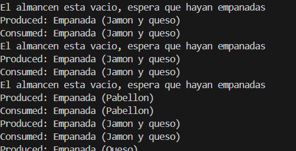

# Experimiento-uno
✔️ Requisitos
*1 producto
*1 consumidor
*el productor genera 5 empanadas
*el consumidor come de esas 5 empanadas

✔️ Objetivo
producción → almacenaje → consumo.

✔️ Captura de consola

# El proceso continúa hasta completar las 5 unidades.