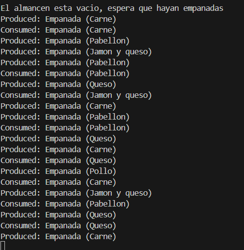

# Experimiento-uno
✔️ Requisitos
Tiempo de producción MUCHO más corto.
Tiempo de consumo más largo.

✔️ Objetivo
El almacén se llena más rápido
→ el productor tiene que esperar
→ se ve más actividad del consumidor.

✔️ Captura de consola

# El consumidor ahora domina la ejecución, y se ve que el productor entra muchas veces en estado de espera porque el buffer se llena mientras el consumidor tarda en comer.