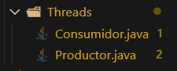

# Empanadas Venezolanas
Una empresa familiar la cual se dedica a la produccion diarias de empanadas de distintos sabores y muy sabrosas,El objetivo es representar, mediante hilos, cómo los productores elaboran las empanadas y los clientes las consumen.

# Producto
*Queso
*Pollo
*Pabellon
*Carne
*Jamon y queso

# Productores

Son los cocineros que hacen las empanadas
cada productor sabe cuantas empanadas tienen que producir y el tiempo aleatorio que se puede tarda las empanas y generar distintos sabores y colocar las empanadas para su consumo.

# Consumidores

Los consumidores serian los clientes quienes compran la empanada, sabe cuantas empanadas quiere consumir este y ver las empanadas disponible y esperar si no hay etc.

# Almacén de Empanadas

Es la capacidad del almacenamiento des las empanadas.

# Objetivo del Simulador

Producir y consumir la misma cantidad total de productos

Sin condiciones de carrera

Mostrando visualmente:

quién produce

qué se produce

quién consume

qué se consume

# Hilos creados

# Estructura del proyecto

# Ramas de experimientos

Se creo una Rama -- experimiento-uno --
Se creo una Rama -- experimiento-dos --
Se creo una Rama -- experimiento-tres --